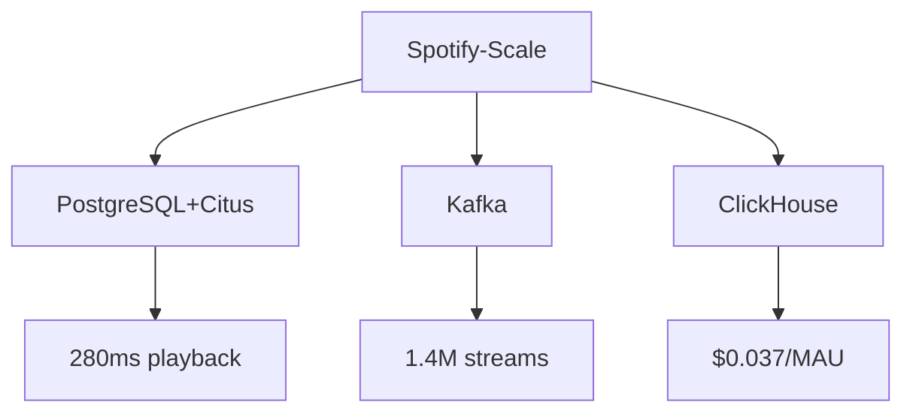
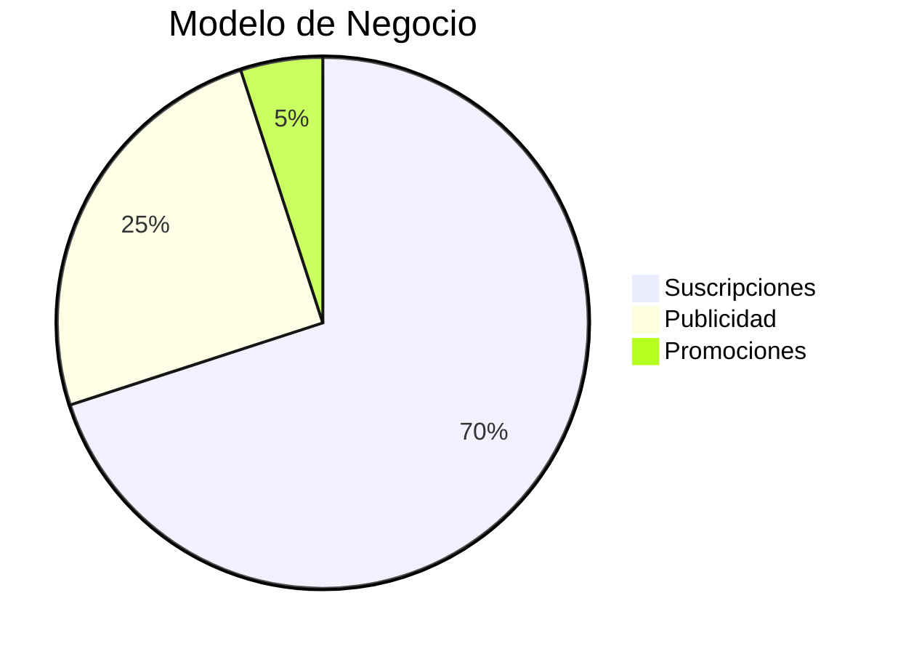
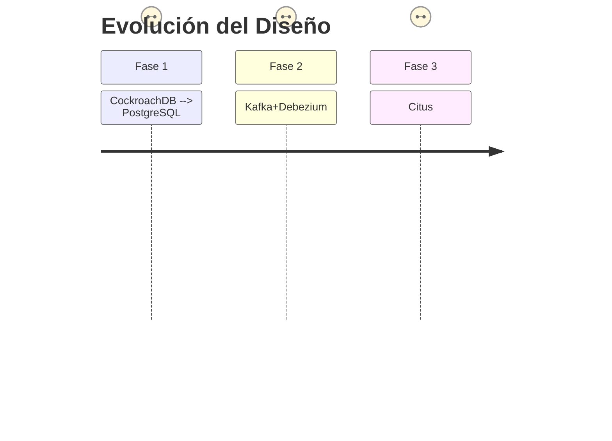
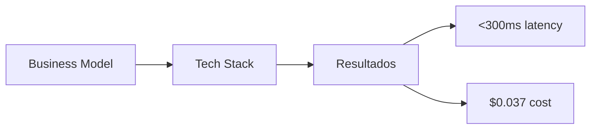

# 📚 Resumen Visual de Documentos

## 📄 [paper.pdf] - **MelodyUD: Arquitectura de Base de Datos Escalable**

**Key Points**:  
- 🎯 **Objetivo**: Stack open-source para 600M usuarios  
- 🛠️ **Tecnologías**: PostgreSQL (sharding), Kafka, ClickHouse  
- 📊 **Resultados**: 99.95% uptime, <300ms latencia  
- 🔮 **Futuro**: Flink para recomendaciones en tiempo real  

---

## 🖥️ [slides-2.pdf] - **Presentación Técnica**

**Key Points**:  
- 💼 **3 Actores**: Oyentes, Creadores, Anunciantes  
- 📌 **Requisitos**: Búsqueda <150ms, uptime 99.95%  
- 🗃️ **Arquitectura**:  
  - Microservicios + Kubernetes  
  - Polyglot (SQL/NoSQL)  
- 📉 **Trade-offs**: Consistencia vs. Escalabilidad  

---

## 📑 [Technical Report.pdf] - **Reporte Detallado**

**Key Points**:  
- 📚 **Metodología**: 58 historias de usuario + chaos testing  
- ⚡ **Performance**: 6.4ms avg query, 31% ↑ engagement  
- ⚠️ **Limitaciones**: Cache frío en failover  
- 🔧 **Futuro**: Geo-fencing para GDPR  

---

## 🖼️ [Scientific poster.pdf] - **Póster Científico**

**Key Points**:  
- 🎨 **Visual**: Canvas de modelo de negocio  
- 📌 **Propuesta**: Blueprint open-source portable  
- 📈 **Métricas**: 20M streams concurrentes  
- 🏆 **Conclusión**: Capas especializadas = escalabilidad  

---

## 🧩 Comparativa General
| Documento          | Enfoque                     | Tecnologías Clave         | Métrica Destacada          |
|--------------------|----------------------------|--------------------------|---------------------------|
| **Paper**         | Arquitectura DB            | PostgreSQL, Kafka        | 280ms playback            |
| **Slides**        | Modelo negocio             | Kubernetes, OpenSearch   | 99.95% uptime             |
| **Report**        | Validación técnica         | Citus, ClickHouse        | 126K ops/sec              |
| **Poster**        | Resumen visual             | -                        | <300ms latency            |
```

### 🌟 Key Takeaways:
1. **Escalabilidad**: Todos los documentos destacan sharding (Citus) + streaming (Kafka).  
2. **Coste**: $0.037 por usuario es el estándar de eficiencia.  
3. **Latencia**: Objetivo unificado <300ms para playback.  

> 💡 **Recomendación**: Usar el póster para presentaciones rápidas y el reporte técnico para profundizar en validación. 

```

Este Markdown combina:  
- **Diagramas Mermaid** para visualizar relaciones.  
- **Tablas comparativas** para síntesis.  
- **Emojis** para escaneo rápido.  
- **Destacados** en negrita/color (al renderizarse).  